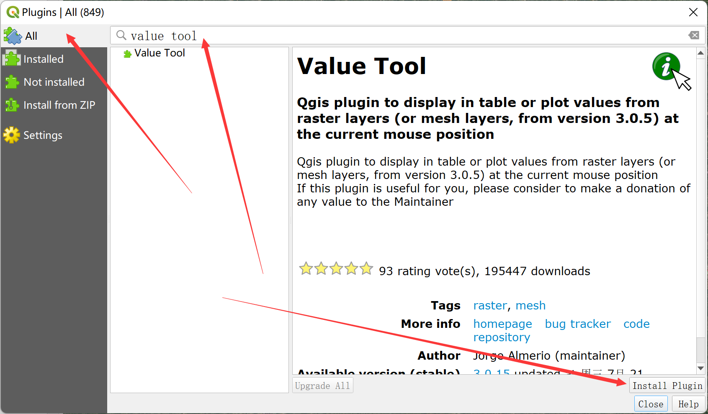
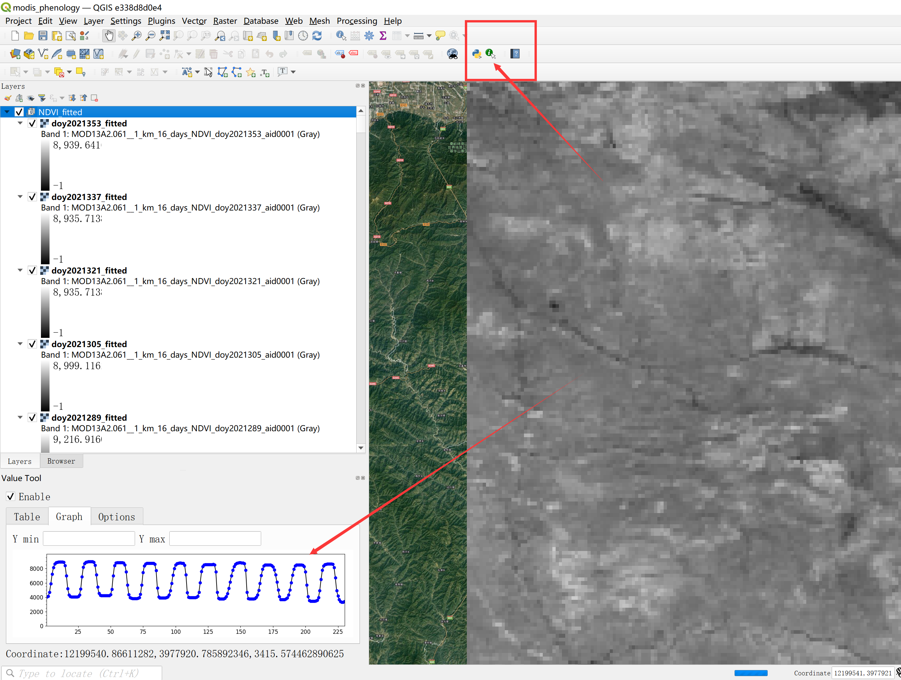

[QGIS](https://www.qgis.org/zh-Hans/site/)的很多功能与ArcGIS相似，其优势在于开源、开源、开源。这里我们介绍如何用QGIS查看影像时间序列中任一像元的时间序列曲线。

关于安装QGIS，我的一点小感受：安装QGIS最好使用**OSGeo4W网络安装程序**安装，因为**QGIS独立安装程序**经常出现一些小的bug。

安装好QGIS之后，再安装一个小插件(plugin): 菜单栏找到`Plugins → Manage and Install Plugins`，搜索栏中输入`value tool`，然后右下角`Install Plugin`：

安装成功之后，界面框会出现Value Tool的小程序界面，如果没有的话，点击小工具栏图标(见下图)，打开时间序列影像，然后鼠标所到之处，像元的时间序列曲线就显示在了Value Tool小工具中：

