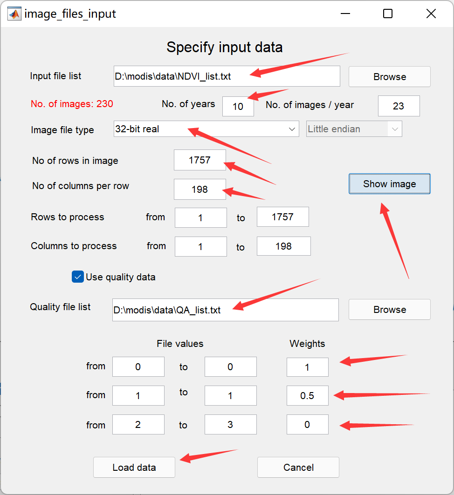
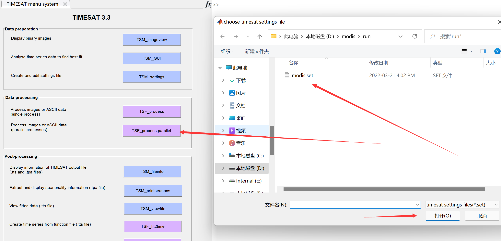
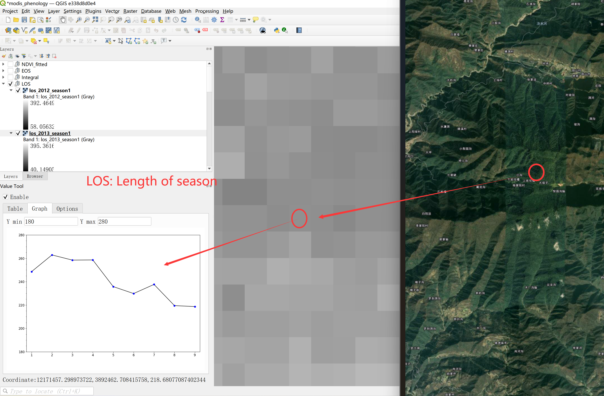
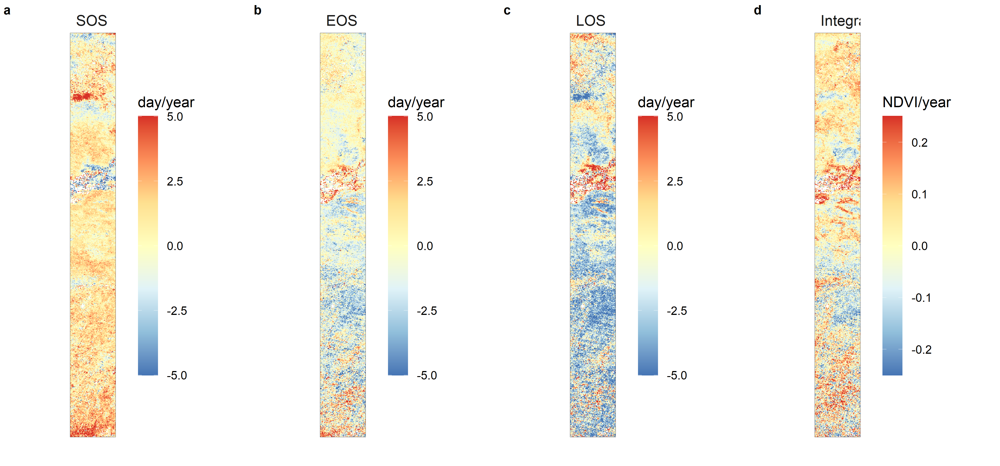

[TIMESAT软件](https://web.nateko.lu.se/timesat/timesat.asp)是由瑞典隆德大学的[Lars Eklundh](https://web.nateko.lu.se/Personal/Lars.Eklundh/)及瑞典马尔默大学的 [Per Jönsson](https://mau.se/en/persons/per.jonsson/)在大约20年前开发的遥感物候分析工具，被全球遥感界广泛使用，最近欧洲哥白尼计划项目下的高分辨率物候和生产力产品[HR-VPP](https://land.copernicus.eu/pan-european/biophysical-parameters/high-resolution-vegetation-phenology-and-productivity)就是基于TIMESAT生成的。TIMESAT使用[FORTRAN语言](https://baike.baidu.com/item/FORTRAN%E8%AF%AD%E8%A8%80/295590)编写，该语言面向科学计算，相较于其他编程语言，其运算效率号称是最快的。

本页介绍利用TIMESAT软件和MODIS NDVI产品进行物候分析，包括：数据下载、数据准备、数据处理、结果制图、分析整个过程，详细英文教程可以参见[TIMESAT用户手册](/)。

# **1. 数据下载和预处理**

# 1.1 MODIS NDVI 标准产品

`NDVI`是`MODIS`的标准产品之一，包括16天合成和月合成两种时间分辨率、250米/500米/1公里/0.05度四种空间分辨率，网址：<https://modis.gsfc.nasa.gov/data/dataprod/mod13.php>，其中`MOD13`来自上午星`TERRA`，`MYD13`来自下午星`AQUA`。

<center>


</center>

我们使用16天合成的1公里分辨率的 `MOD13A2 v061` 版产品为例进行实验，其详细介绍在：<https://lpdaac.usgs.gov/products/mod13a2v061/>.

<center>


</center>

数据获取途径有很多，我们使用[AppEEARS](https://lpdaacsvc.cr.usgs.gov/appeears/)

<center>


</center>

## 1.2 AppEEARS 数据下载流程

首先登录账户，点击菜单栏中的`Extract` → `Area`，然后选择`Start a new request`。

<center>


</center>

选择一个感兴趣区域，可以利用交互式地图选取，这里我们用方框选取从北方草原到南方森林的一个长条地区作为实验区，选择这里纯粹是个人爱好，你也可以选取其他任何区域，但是要注意：实验区的面积越大，你处理的数据量也就越大。给自己选定的区域一个名称，这里我们输入`modis_course`。

<center>


</center>

指定影像数据的开始时间和结束时间，这里我们选择2011年到2021年。 在`Select the layers to include in the Sample`对话框中，输入`MOD13A2`，找到`Terra MODIS Vegetation Indices (NDVI & EVI) MOD13A2.061`并选择。在图层中选择`NDVI`和`pixel_reliability`。

<center>


</center>

`pixel_reliability`为数据质量概要信息，可以用来过滤掉质量差的数据点（去噪），下图为MOD13用户手册中的介绍，我们将使用这个数据作为TIMESAT的QA数据质量文件输入：

<center>


</center>

然后就可以点击提交了，之后从菜单栏的`Explore`里，可以看到你数据申请的处理状态，等到完成后(Done)，就可以下载了，我们需要NDVI和pixel_reliability两个数据。

<center>


</center>

如果下载过程因网络不稳定而中断了，可以利用搜索栏，选择未完成的文件继续下载。

<center>


</center>

## 1.3 数据预处理

下面我们将使用`R`编程，按照`TIMESAT`对输入数据的格式要求，对下载`MODIS`数据进行预处理。

### 文件组织

创建一个文件夹进行实验操作，其格式如下：

<center>


</center>

将MODIS NDVI的tif文件拷贝到`..\data\GeoTIFF\NDVI`中，质量标识文件 pixel reliability的tif文件拷贝到`..\data\GeoTIFF\QA`中。注意这两组数据应一一对应，以我们这个实验为例，NDVI和pixel reliability分别有230个文件，从2011年到2021年，每年23个16天合成的数据。

### 影像数据格式转换

将下载的`GeoTIFF`数据转成二进制`ENVI`格式才能输入到`TIMESAT`中。`ENVI`软件的数据格式既是二进制+头文件(`*.hdr`，对二进制文件的解释)。

这里，我们用`R`代码进行格式转换。首先，打开`RStudio`，新建R Script文件：

<center>


</center>

将以下代码粘贴到新建的`R Script`文件中，并保存在`Rcode`文件夹下。注意根据你的实际情况修改文件路径。

```{r eval=FALSE, include=TRUE}
#加载需要用的软件包
if (!require("tidyverse")) install.packages("tidyverse"); library(tidyverse)
if (!require("terra")) install.packages("terra"); library(terra)

# 获取tif数据文件的路径列表
tif_files <- list.files(path = "D:/modis/data/GeoTIFF", 
                        pattern = ".tif",
                        full.names = TRUE,
                        recursive = TRUE)

# 准备envi输出文件的路径列表
envi_files <- tif_files %>% str_replace(".tif", ".envi") %>% 
  str_replace("GeoTIFF", "ENVI")

# 读取tif文件为栅格数据
data <- rast(tif_files)

# 生成envi格式的文件
writeRaster(data, filename = envi_files)

# 准备envi格式数据列表的list文件，用于TIMESAT读取
num <- length(envi_files) / 2 # 影像时间序列个数

# 将文件分隔符从“/” 转成 “\”
envi_files_b <- str_replace_all(envi_files, "/", "\\\\") 

# 分别取出 NDVI 和 QA 文件路径列表
ndvi_envi_files_b <- str_subset(envi_files_b, "NDVI")
qa_envi_files_b <- str_subset(envi_files_b, "pixel_reliability")

#按照TIMESAT要求的格式组织NDVI list文件，并输出txt文件
append(as.character(num), ndvi_envi_files_b) %>% 
  as.data.frame() %>% 
  write.table(file = "D:/modis/data/NDVI_list.txt",
            sep = "\n", quote = FALSE, 
            row.names = FALSE, col.names = FALSE)

#按照TIMESAT要求的格式组织QA list文件，并输出txt文件
append(as.character(num), qa_envi_files_b) %>% 
  as.data.frame() %>% 
  write.table(file = "D:/modis/data/QA_list.txt",
              sep = "\n", quote = FALSE, 
              row.names = FALSE, col.names = FALSE)
```

运行`R`文件的方法为：选中要运行的部分，点击右上角的`Run`图标，或`Ctrl + Enter`：

<center>


</center>


### 转换后的文件

转换完成后，`data/ENVI`文件夹中应该看到envi格式的NDVI和QA数据，如下图所示：

<center>


</center>

其中`.hdr`为头文件，包含了envi二进制数据的信息，可以用文本编辑器打开查看，如行列数、数据类型、投影等：

<center>


</center>

`data`文件夹中会生成两个`txt`文件，分别为`NDVI`和`pixel_reliability`文件(即`TIMESAT`中要使用的`QA`文件)的路径列表(`list`)，会作为`TIMESAT`软件的输入文件使用。`txt`文件的第一行为输入数据的总个数，这里是`230`个 = `23`个/年 \* `10`年：

<center>


</center>

至此，数据准备完成，可以打开matlab运行TIMESAT软件了。

# **2. 运行TIMESAT计算物候参数**

## 2.1 matlab设置

将实验文件夹设为工作目录，这里是`D:\modis`。然后点击`Set Path`添加`TIMESAT`软件的路径：

<center>


</center>

选择`Add with Subfolders..`，导航到`timesat33`软件的路径，选择`timesat_matlab`文件夹：

<center>


</center>

<center>


</center>

<center>


</center>

然后在`matlab`命令行输入`timesat`，回车，就可以打开软件界面啦，包含三个模块：

<center>


</center>

## 2.2 TIMESAT查看数据和生成设置文件

点击`TSM_imageview`，打开之后选择`File → open file list`：

<center>


</center>

选择之前在`R`中生成的`list`文件`..data/NDVI_list.txt`，在`TSM_imageview`窗口中输入影像的数据类型、行列数，这些信息可以打开任一个`ENVI`的头文件`.hdr`获取，填好以后，点击`Draw`，就可以看到实验区`NDVI`的空间分布了，在列表中选择任一个时间的文件，点击`Draw`之后就会更新：

<center>


</center>

点击`TSM_GUI`，打开之后选择`File → Open list image files`：

<center>


</center>

选择之前在`R`中生成的`NDVI`和`QA`的`list`文件，配置如下所示：

<center>



</center>

其中，`QA`用来根据不同数据质量赋予`NDVI`观测点权重，这里我们把天空晴朗的无云观测(`QA`值为`0`)赋予权重为`1`；把数据质量一般的观测(`QA`值为`1`)赋予权重为`0.5`，有云和雪覆盖的观测(`QA`值为`2-3`)赋予权重为`0`。

点击`Show image`可以选择显示时间序列的窗口范围：`Rows to process`和`Columns to process`:

<center>


</center>

选择完成之后，点击`Load data`就可以看到时间序列啦：

<center>


</center>

这里是查看时间序列、选定拟合函数、以及设置各种物候提取参数的界面，尝试点击调整不同的设置，探索最佳的或可以接受的参数设置，然后选择`Settings → Save to settings file` 来设置`settings`文件：

<center>


</center>

检查一下设置，然后就可以保存设置文件到`/run`文件夹了。这里可以为每一种植被类型(`Land cover`)设置不同的参数，我们暂且用同一种参数实验。准备好`settings`文件后，就可以运行处理了。

## 2.3 TIMESAT执行数据处理

### 单核处理

点击`TSF_process`，选择配置文件`modis.set`：

<center>


</center>

桌面会弹出`cmd`窗口，`TIMESAT`开始逐行处理影像时间序列：

<center>


</center>

### 并行处理

如果数据处理量较大，`TIMESAT`还提供了并行处理。可以按`Ctrl + c`停止，然后点击`TSF_process parallel`，键入想要使用的处理器个数(最好不要把所有的`CUP`都占用，容易死机)：

<center>



</center>

<center>


</center>

然后，会弹出`cmd`窗口，同时`TIMESAT`会将生成相应个数的`settings`文件，以及`.bat`批处理文件。在`cmd`窗口中键入 `.bat`文件名，`TIMESAT`就开始进行并行处理了：

<center>


</center>

处理完成后，`/run`文件夹中会生成`.tts`、`.tpa`、`.ndx`文件，这是TIMESAT的中间文件，可以用来查看处理结果，经过后处理即可生成`ENVI`二进制格式的影像结果了。

<center>


</center>

# **3 TIMESAT结果查看和后处理**

## 3.1 生成拟合时间序列影像

曲线拟合可以将原始数据中存在云污染等的观测值进行填补，生成时空连续的影像序列，可以用`TSM_viewfits`来查看拟合结果：

<center>


</center>

`TIMESAT`输出的拟合结果去除了噪音，具有时空连续性，可以将该结果输出为二进制影像文件，点击`TSF_fit2img`：

<center>


</center>

按照提示在`cmd`窗口中键入参数，生成结果：

<center>


</center>

现在`run`文件夹中的文件很多了，为了更清楚的组织文件，我们可以新建文件夹`fitted_image/TIMESATout`，并把生成拟合影像序列移动过去。

为了查看拟合后的时空连续的`NDVI`影像，我们介绍两种方法：

1.  利用如下`R`代码生成`list`文件`txt`，就可以使用`TIMESAT`的`TSM_imageview`查看拟合后的影像(记得根据自己实际情况更改文件路径)：

```{R eval=FALSE, include=TRUE}
# 生成TIMESAT读list需要的txt文件

#加载需要用的软件包
if (!require("tidyverse")) install.packages("tidyverse"); library(tidyverse)

# 获取影像数据文件的路径列表
files <- list.files(path = "D:/modis/run/fitted_image/TIMESATout", 
                    pattern = "modis_fited_image_",
                    full.names = TRUE) %>% 
  str_subset(".hdr", negate = T)

# 准备数据列表的list文件，用于TIMESAT读取
num <- length(files)  # 影像时间序列个数
files_b <- str_replace_all(files, "/", "\\\\") # 将文件分隔符从“/” 转成 “\”

#按照TIMESAT要求的格式组织NDVI list文件，并输出txt文件
append(as.character(num), files_b) %>% 
  as.data.frame() %>% 
  write.table(file = "D:/modis/run/modis_fited_image_list.txt",
              sep = "\n", quote = FALSE, 
              row.names = FALSE, col.names = FALSE)
              
```

2.  给`TIMESAT`生成的拟合二进制文件添加`.hdr`头文件，并转成`tif`，这样就可以用其他软件(比如ENVI和GIS软件等)进行查看了，比如，在QGIS中[查看影像时间序列](https://fengtian2020.github.io/ess_course/qgis.html)。首先，再`modis/run`目录下创建`txt`文件，命名为`add.hdr`，将二进制文件的信息填入，这个可以复制原始的NDVI头文件内容(路径为：`D:\modis\data\ENVI\NDVI`)。然后，在`fitted_image`文件夹下创建`tif`文件夹，之后运行下面的`R`代码：

```{r eval=FALSE, include=TRUE}
# 将TIMESAT生成的二进制文件图像转换成tif格式

#加载需要用的软件包
if (!require("tidyverse")) install.packages("tidyverse"); library(tidyverse)
if (!require("terra")) install.packages("terra"); library(terra)

# 获取影像数据文件的路径列表
files <- list.files(path = "D:/modis/run/fitted_image/TIMESATout",
                    pattern = "modis_fited_image_",
                    full.names = TRUE) %>%
  str_subset(".hdr", negate = T)

# 生成头文件 -------------------------------------------------------------------

outname <- paste0(files, ".hdr")

# 读取原始NDVI数据的头文件
hdr <- read_file("D:/modis/run/add.hdr")

# 生成所有拟合影像文件相应的hdr文件
for (i in c(1: length(files))) {
  write_file(hdr, outname[i])
}

# 输出文件命名，对应到原始NDVI影像的命名方式
doy_file_names <- list.files("D:/modis/data/GeoTIFF/NDVI", pattern = ".tif") %>% 
  str_extract("doy\\d{7}") %>% paste0("_fitted.tif")

tif_out_files <- paste0("D:/modis/run/fitted_image/tif/", doy_file_names)

# 生成拟合后的TIFF格式影像
writeRaster(rast(files), tif_out_files, overwrite = T)

```

下面的`R`代码可以生成`NDVI`的空间分布图以及`GIF`动图：

```{r eval=FALSE, include=TRUE}

# 生成拟合后的影像序列动图

#加载需要用的软件包
if (!require("terra")) install.packages("terra"); library(terra)
if (!require("tidyverse")) install.packages("tidyverse"); library(tidyverse)
if (!require("rasterVis")) install.packages("rasterVis"); library(rasterVis)
if (!require("magick")) install.packages("magick"); library(magick)

files <- list.files(path = "D:/modis/run/fitted_image/tif", 
                   pattern = ".tif",
                   full.names = TRUE) %>% 
  str_subset(".aux.xml", negate = T)
data <- rast(files) / 10000 # NDVI系数
lyrnames <- str_extract(names(data), "\\d{7}")  # 取出影像的时间
lyryear <- str_extract(names(data), "\\d{4}") # 取出年份
lyrdoy <- str_extract(names(data), "\\d{3}$") # 取出day of the year

names(data) <- lyrnames # 把影像序列按时间重命名


# 生成2020年所有doy的图 ----------------------------------------------------------

# 创建结果输出文件夹
if (dir.exists("D:/modis/figure/2020doy")==0)  dir.create("D:/modis/figure/2020doy")

# 2020年的影像在整个时间序列中的序号为23*(2020-2012)+1 到 23*(2020-2012) + 24
for (idx in c((23*(2020-2012)+1) : (23*(2020-2012) + 24))) {
  # 每次取一个doy的影像
  dataplot <- data[[idx]]
  
  # 重命名为DOY的值
  doy <- lyrdoy[idx]
  names(dataplot) <- doy
  
  p <- gplot(dataplot) +
    geom_tile(aes(fill = value))+
    scale_fill_viridis_c("NDVI", option = "B", na.value = NA, limits = c(-0.0001, 1)) +
    coord_equal() +
    scale_x_continuous(expand = c(0, 0)) + 
    scale_y_continuous(expand = c(0, 0))+
    labs(x = "", y = "", title = doy) +
    theme_bw(base_size = 16) +
    theme(panel.grid = element_blank(), 
          panel.border = element_rect(size = 0.2),
          strip.background = element_blank(),
          strip.text = element_text(hjust = 0, size = 16),
          axis.ticks = element_blank(),
          axis.text = element_blank(),
          legend.key.height = unit(0.13, "npc"),
          legend.key.width = unit(0.05, "npc"),
    )
  pngfile <- paste0("D:/modis/figure/2020doy/", doy, ".png")
  ggsave(pngfile, height = 7, width = 2.5)
  
}
y <- 
# 生成2020年各DOY(day of year) 的gif动图，用到的是magick package
imgs <- list.files(path = "D:/modis/figure/2020doy", 
                   pattern = ".png",
                   full.names = TRUE)

img_list <- lapply(imgs, image_read)

## join the images together
img_joined <- image_join(img_list)

## animate at 2 frames per second
img_animated <- image_animate(img_joined, fps = 4)

## save to disk
image_write(image = img_animated,
            path = "D:/modis/figure/2020_NDVI.gif")


# 生成2012-2021年间每年的季节NDVI图 -------------------------------------------------

if (dir.exists("D:/modis/figure/NDVIyear")==0)  dir.create("D:/modis/figure/NDVIyear")

for (year in c(2012:2021)) {
  years <- as.numeric(lyryear)
  idx <- which(years == year)
  dataplot <- data[[idx]]
  names(dataplot) <- lyrdoy[idx]
  
  p <- gplot(dataplot) +
    geom_tile(aes(fill = value))+
    scale_fill_viridis_c("NDVI", option = "B", na.value = NA, limits = c(-0.0001, 1)) +
    coord_equal() +
    facet_wrap(~ variable, nrow = 1) +
    scale_x_continuous(expand = c(0, 0)) + 
    scale_y_continuous(expand = c(0, 0))+
    labs(x = "", y = "", title = year) +
    theme_bw(base_size = 16) +
    theme(panel.grid = element_blank(), 
          panel.border = element_rect(size = 0.2),
          strip.background = element_blank(),
          strip.text = element_text(hjust = 0, size = 16),
          axis.ticks = element_blank(),
          axis.text = element_blank(),
          legend.key.height = unit(0.12, "npc"),
    )
  pngfile <- paste0("D:/modis/figure/NDVIyear/", year, ".png")
  ggsave(pngfile,height = 6, width = 15)
  
}
y

# 生成2012-2021年间的分DOY(day of year) gif动图，用到的是magick package
imgs <- list.files(path = "D:/modis/figure/NDVIyear", 
                    pattern = ".png",
                    full.names = TRUE)

img_list <- lapply(imgs, image_read)

## join the images together
img_joined <- image_join(img_list)

## animate at 2 frames per second
img_animated <- image_animate(img_joined, fps = 2)

## save to disk
image_write(image = img_animated,
            path = "D:/modis/figure/year_NDVI.gif")

```

生成的结果见下图所示：

1.  2020年NDVI变化动图，及其全年展开图

<center>


</center>


<center>


</center>

2. 2012-2021年间NDVI变化总览动图

<center>


</center>


## 3.2 生成物候参数结果影像

### 单个物候参数、单个年份引导的方式：

点击`TSF_seas2img`生成物候参数影像：

<center>


</center>

按照提示输入参数：

<center>


</center>

使用`TSM_imageview`查看物候参数：

<center>


</center>

### 利用.bat文件进行批量生成

**利用上面的步骤可以检查和理解TIMESAT物候参数的输出格式和设计思路：**

1.  每年最多可以探测出两个生长季，如果每一个像元只有一个生长季，则其第二个季节的物候参数为填充值

2.  对于时间类的输出结果，如生长季开始时间`start-of-season time` (`SOS`)，其结果为整个影像时间序列的序号，而非我们常用的日期或`DOY` (Day of Year，一年中的天数)。

如果要生成多个物候参数、多年的结果，用前面的方式则太过繁琐，对此，我们可以在命令行中一次性的输入上述引导步骤中所需要的所有参数，例如，上图`cmd`中的过程就可以用一行代码来实现：

```{bash eval=FALSE, include=TRUE}
D:\modis\run> TSF_seas2img modis_TS.tpa 1 1 23 -1 -2 sos_2012 3
```

其中，TSF_seas2img为TIMESAT中的函数，modis_TS.tpa为之前运行TIMESAT计算物候参数后生成的文件，后面数字1表示具体物候参数指标（见下图），之后的数字参数含义也都可以参看上图`cmd`中引导对话框的内容。

<center>


</center>

因此，每个物候参数、每一年的提取都可以用一行代码来实现，把这些代码穿起来组织成一个`.bat`文件，就可以像之前进行`TIMESAT`数据并行处理(`TSF_process parallel`)那样，利用`.bat`文件进行物候参数提取的批处理了。我们用下面的`R`代码来生成这个`.bat`文件（生成的`.bat`文件可以用文本编辑器打开，见代码之后的图）：

```{r eval=FALSE, include=TRUE}
# 生成批处理的.bat文件，将TIMESAT的物候参数输出为影像

if (!require("tidyverse")) install.packages("tidyverse"); library(tidyverse)

cmd <- NULL
# 对所有物候参数进行循环
for (para in c(1,2,3,5,10)){ # 将准备提取的物候参数对应的数字填到这里
  
  # 建立物候参数名称和代表值的查找表，对应TIMESAT的物候参数指标
  pheno <- case_when(
              para == 1 ~ "sos",       # Start-of-season time
              para == 2 ~ "eos",       # End-of-season time
              para == 3 ~ "los",       # Length of season
              para == 4 ~ "base",      # Base value
              para == 5 ~ "middle",    # Time of middle of season
              para == 6 ~ "maxval",    # Maximum value value of fitted data
              para == 7 ~ "amp",       # Amplitude
              para == 8 ~ "lder",    # Left derivative
              para == 9 ~ "rder",    # Right derivative
              para == 10 ~ "integral", # Large integral
              para == 11 ~ "sintegral",    # Small integral
              para == 12 ~ "sosval",    # Start-of-season value
              para == 13 ~ "eosval",    # End-of-season value
            )
  
    # 对所有年分循环
  for (year in c(2012:2021)) {   # 准备提取的年份
    
    # 找出每年23个影像在整个时间序列的位置
    idx_start <- (year - 2012) * 23 + 1
    idx_end <- (year - 2012) * 23 + 1 + 23
    outname <- paste(pheno, year, sep = "_")
    
    # 命令行代码
    tmp <- paste("TSF_seas2img", "modis_TS.tpa", para, idx_start, idx_end, -1, -2, outname, 3, sep = " ")
    
    cmd <- c(cmd, tmp)
  }
}

write_lines(cmd, "D:/modis/run/season2img.bat")

```

<center>


</center>


之后就可以在`cmd`命令行中输入`.bat`文件名进行批处理了:

```{bash eval=FALSE, include=TRUE}
D:\modis\run>season2img.bat
```

运行完成后，你的文件夹中就生成了物候参数的二进制文件，这些二进制影像文件可以使用TIMESAT的`TSM_imageview`工具来查看了。

<center>


</center>

## 3.3 物候参数数据后处理

首先，我们将提取的物候参数结果移动到一个单独的文件夹中，创建`pheno_img/TIMESATout`文件夹和子文件夹，将结果移动过来，然后在pheno_img文件夹下创建`tif`文件夹用来存放tif文件

`TIMESAT`的`SOS`和`EOS`的输出结果是整个时间序列的序号，为此，我们要通过计算将其转换成`DOY`或是具体的日期。这个步骤看似容易，但实际比较棘手(tricky)，因为有的地方一个完整的生长季可以是跨年的，比如南方的生长季结束时间有可能出现在第二年的2月份。对此，我们将以生长季峰值(`Time of middle of season`)出现的年份为准，来转换生长季开始(`SOS`)和结束(`EOS`)的时间，`R`代码如下(这里我们只针对第一个生长季`season 1`进行操作)：

```{r eval=FALSE, include=TRUE}
# 将TIMESAT生成的二进制文件图像转换成tif格式, 

#加载需要用的软件包
if (!require("tidyverse")) install.packages("tidyverse"); library(tidyverse)
if (!require("terra")) install.packages("terra"); library(terra)

# 获取影像数据文件的路径列表
files <- list.files(path = "D:/modis/run/pheno_img/TIMESATout",
                    full.names = TRUE) %>%
  str_subset(".txt|.hdr", negate = T) %>% 
  str_subset("season1")

# 生成头文件 -------------------------------------------------------------------
# copy原始输入数据ENVI影像的头文件.hdr信息到最近拟合平滑后的二进制文件中

outname <- paste0(files, ".hdr")

hdr <- read_file("D:/modis/run/add.hdr")

# 生成所有拟合影像文件相应的hdr文件
for (i in c(1: length(files))) {
  write_file(hdr, outname[i])
}

# 将season 1的各个参数转换到相应年份的DOY，输出为tif影像文件
# 由于EOS和SOS有可能会跨年，这里以middle of season的年份为准来计算, 取每年影像个数23的余数

# 读取数据
sosfiles <- files %>% str_subset("sos")
sos <- rast(sosfiles)

eosfiles <- files %>% str_subset("eos")
eos <- rast(eosfiles)

losfiles <- files %>% str_subset("los")
los <- rast(losfiles)

middlefiles <- files %>% str_subset("middle")
mid <- rast(middlefiles)

integralfiles <- files %>% str_subset("integral")
integ <- rast(integralfiles)

midyear <- mid %% 23 # 返回值为middle of season 所在年份的 
middoy <- midyear * 16 # 再乘以时间分辨率16天

sosdoy <- (midyear - (mid - sos)) * 16 # SOS在middle的左边
eosdoy <- (midyear + (eos - mid)) * 16 # SOS在middle的右边
losday <- los * 16 
integscaled <- integ / 10000


# 输出tif文件 -----------------------------------------------------------------

# 输出文件命名
tif_out_files <- c(sosfiles, eosfiles, losfiles, integralfiles) %>% 
  str_replace("TIMESATout", "tif") %>% paste0(".tif") 

# 生成拟合后的TIFF格式影像
c(sosdoy, eosdoy, losday, integscaled) %>% 
  writeRaster(tif_out_files)

```

通过这些操作，我们终于得到了TIMESAT计算的物候参数结果影像`modis/run/pheno_img/tif/`，本实验选取了`SOS`, `EOS`, `LOS`, `Large integral`(NDVI曲线的积分，表征生产力)。之后，就可以分析这些物候参数的时空变化规律了。

# **4 物候时空变化分析**

## 4.1 空间格局

物候参数的空间格局可以通过制图进行可视化，下面是利用`R`制图的一些代码，运行下面代码时，建议首先创建文件夹存放生成的结果，这里为`modis/figure`(如果上面的步骤中已经创建了这个文件夹，就不用重复创建了)，对每个参数逐个选中运行（或逐行运行）：

```{r eval=FALSE, include=TRUE}
#加载需要用的软件包
if (!require("terra")) install.packages("terra"); library(terra)
if (!require("tidyverse")) install.packages("tidyverse"); library(tidyverse)
if (!require("rasterVis")) install.packages("rasterVis"); library(rasterVis)
if (!require("magick")) install.packages("magick"); library(magick)

# SOS ---------------------------------------------------------------------

# 文件路径
sosfiles <- list.files("D:/modis/run/pheno_img/tif", full.names = T) %>% 
  str_subset("sos") %>% 
  str_subset(".aux.xml", negate = T)

# 读取影像文件
sos <- rast(sosfiles)
names(sos) <- c(2012:2021) # 重命名为年份

# 利用RasterVis和ggplot2 packages制图
psos <- gplot(sos[[1:9]]) +
  geom_tile(aes(fill = value))+
  scale_fill_viridis_c("DOY", option = "B", na.value = NA, limits = c(40, 200)) +
  coord_equal() +
  facet_wrap(~ variable, nrow = 1) +
  scale_x_continuous(expand = c(0, 0)) + 
  scale_y_continuous(expand = c(0, 0))+
  labs(x = "", y = "", title = "SOS") +
  theme_bw(base_size = 16) +
    theme(panel.grid = element_blank(), 
          panel.border = element_rect(size = 0.2),
          strip.background = element_blank(),
          strip.text = element_text(hjust = 0, size = 16),
          axis.ticks = element_blank(),
          axis.text = element_blank(),
          legend.key.height = unit(0.12, "npc"),
  )

psos #在R中输出结果

# 将结果存储到本地文件
ggsave("D:/modis/figure/SOS.png", height = 7, width = 10)


# EOS ---------------------------------------------------------------------

eosfiles <- list.files("D:/modis/run/pheno_img/tif", full.names = T) %>% 
  str_subset("eos") %>% 
  str_subset(".aux.xml", negate = T)

eos <- rast(eosfiles)
names(eos) <- c(2012:2021)


peos <- gplot(eos[[1:9]]) +
  geom_tile(aes(fill = value))+
  scale_fill_viridis_c("DOY", option = "B", na.value = NA, limits = c(280, 420)) +
  coord_equal() +
  facet_wrap(~ variable, nrow = 1) +
  scale_x_continuous(expand = c(0, 0)) + 
  scale_y_continuous(expand = c(0, 0))+
  labs(x = "", y = "", title = "EOS") +
  theme_bw(base_size = 16) +
    theme(panel.grid = element_blank(), 
          panel.border = element_rect(size = 0.2),
          strip.background = element_blank(),
          strip.text = element_text(hjust = 0, size = 16),
          axis.ticks = element_blank(),
          axis.text = element_blank(),
          legend.key.height = unit(0.12, "npc"),
  )

peos #在R中输出结果

# 将结果存储到本地文件
ggsave("D:/modis/figure/EOS.png", height = 7, width = 10)


# LOS ---------------------------------------------------------------------

losfiles <- list.files("D:/modis/run/pheno_img/tif", full.names = T) %>% 
  str_subset("los") %>% 
  str_subset(".aux.xml", negate = T)

los <- rast(losfiles)
names(los) <- c(2012:2021)


plos <- gplot(los[[1:9]]) +
  geom_tile(aes(fill = value))+
  scale_fill_viridis_c("days", option = "B", na.value = NA, limits = c(150, 350)) +
  coord_equal() +
  facet_wrap(~ variable, nrow = 1) +
  scale_x_continuous(expand = c(0, 0)) + 
  scale_y_continuous(expand = c(0, 0))+
  labs(x = "", y = "", title = "LOS") +
  theme_bw(base_size = 16) +
    theme(panel.grid = element_blank(), 
          panel.border = element_rect(size = 0.2),
          strip.background = element_blank(),
          strip.text = element_text(hjust = 0, size = 16),
          axis.ticks = element_blank(),
          axis.text = element_blank(),
          legend.key.height = unit(0.12, "npc"),
  )

plos #在R中输出结果

# 将结果存储到本地文件
ggsave("D:/modis/figure/LOS.png", height = 7, width = 10)

# Integral ---------------------------------------------------------------------

integfiles <- list.files("D:/modis/run/pheno_img/tif", full.names = T) %>% 
  str_subset("integral") %>% 
  str_subset(".aux.xml", negate = T)

integ <- rast(integfiles)
names(integ) <- c(2012:2021)


pinteg <- gplot(integ[[1:9]]) +
  geom_tile(aes(fill = value))+
  scale_fill_viridis_c("Integral", option = "B", na.value = NA, limits = c(1, 18)) +
  coord_equal() +
  facet_wrap(~ variable, nrow = 1) +
  scale_x_continuous(expand = c(0, 0)) + 
  scale_y_continuous(expand = c(0, 0))+
  labs(x = "", y = "", title = "Integral") +
  theme_bw(base_size = 16) +
    theme(panel.grid = element_blank(), 
          panel.border = element_rect(size = 0.2),
          strip.background = element_blank(),
          strip.text = element_text(hjust = 0, size = 16),
          axis.ticks = element_blank(),
          axis.text = element_blank(),
          legend.key.height = unit(0.12, "npc"),
  )

pinteg

ggsave("D:/modis/figure/small_integral.png", height = 7, width = 10)

```

可以看出，在选定的实验区内物候参数呈现出了明显的空间格局，北方的草原和南方的林地形成了明显的梯度。

## 4.2 时间变化

利用QGIS可以[查看影像时间序列](https://fengtian2020.github.io/ess_course/qgis.html)，例如，下图显示位于秦岭的某一像元的生长季长度从2012年到2020年间逐渐缩短：

<center>



</center>

我们可以将每年的物候参数和年份时间序列(这里为`2012: 2020`年)做线性回归 `y = ax + b`，其中`y`为特定的物候参数序列，`x`为时间序列，得到的斜率`a`即可以表征物候随时间变化的趋势，具体计算见下面的`R`代码：

```{r eval=FALSE, include=TRUE}
#加载需要用的软件包
if (!require("terra")) install.packages("terra"); library(terra)
if (!require("tidyverse")) install.packages("tidyverse"); library(tidyverse)
if (!require("rasterVis")) install.packages("rasterVis"); library(rasterVis)

# 计算时间序列变化趋势 y = ax + b
caltrend <- function(x) {
  years <- c(2012:2020)
  data <- x[1:9]
  if (is.na(sum(data))) {
    return(NA)
  } else {
    fit <- lm(data ~ years)
    trend <- summary(fit)$coefficients[2,1]
    return(trend)
  }
}

sosfiles <- list.files("D:/modis/run/pheno_img/tif", full.names = T) %>% 
  str_subset("sos") %>% 
  str_subset(".aux.xml", negate = T)

sos <- rast(sosfiles)
names(sos) <- c(2012:2021)

sostrend <- app(sos, caltrend, cores = 4) #这里可以更改使用的CPU个数
names(sostrend) <- "SOS"

psos <- gplot(sostrend %>% clamp(-5, 5)) +
  geom_tile(aes(fill = value))+
  scale_fill_distiller("day/year", palette = "RdYlBu", 
                       na.value = NA, limits=c(-5, 5)) + #
  coord_equal() +
  facet_wrap(~ variable, nrow = 1) +
  scale_x_continuous(expand = c(0, 0)) + 
  scale_y_continuous(expand = c(0, 0))+
  labs(x = "", y = "") +
  theme_bw(base_size = 16) +
  theme(panel.grid = element_blank(), 
        panel.border = element_rect(size = 0.2),
        strip.background = element_blank(),
        strip.text = element_text(hjust = 0, size = 16),
        axis.ticks = element_blank(),
        axis.text = element_blank(),
        legend.key.height = unit(0.13, "npc"),
        legend.key.width = unit(0.05, "npc")
  )

psos

ggsave("D:/modis/figure/SOS_trend.png", height = 7, width = 2.5)


# EOS ---------------------------------------------------------------------

eosfiles <- list.files("D:/modis/run/pheno_img/tif", full.names = T) %>% 
  str_subset("eos") %>% 
  str_subset(".aux.xml", negate = T)

eos <- rast(eosfiles)
names(eos) <- c(2012:2021)

eostrend <- app(eos, caltrend, cores = 4)
names(eostrend) <- "EOS"

peos <- gplot(eostrend %>% clamp(-5, 5)) +
  geom_tile(aes(fill = value))+
  scale_fill_distiller("day/year", palette = "RdYlBu", 
                       na.value = NA, limits=c(-5, 5)) + #
  coord_equal() +
  facet_wrap(~ variable, nrow = 1) +
  scale_x_continuous(expand = c(0, 0)) + 
  scale_y_continuous(expand = c(0, 0))+
  labs(x = "", y = "") +
  theme_bw(base_size = 16) +
  theme(panel.grid = element_blank(), 
        panel.border = element_rect(size = 0.2),
        strip.background = element_blank(),
        strip.text = element_text(hjust = 0, size = 16),
        axis.ticks = element_blank(),
        axis.text = element_blank(),
        legend.key.height = unit(0.13, "npc"),
        legend.key.width = unit(0.05, "npc"),
  )

peos

ggsave("D:/modis/figure/EOS_trend.png", height = 7, width = 2.5)

# LOS ---------------------------------------------------------------------

losfiles <- list.files("D:/modis/run/pheno_img/tif", full.names = T) %>% 
  str_subset("los") %>% 
  str_subset(".aux.xml", negate = T)

los <- rast(losfiles)
names(los) <- c(2012:2021)

lostrend <- app(los, caltrend, cores = 4)
names(lostrend) <- "LOS"

plos <- gplot(lostrend %>% clamp(-5, 5)) +
  geom_tile(aes(fill = value))+
  scale_fill_distiller("day/year", palette = "RdYlBu", 
                       na.value = NA, limits=c(-5, 5)) + #
  coord_equal() +
  facet_wrap(~ variable, nrow = 1) +
  scale_x_continuous(expand = c(0, 0)) + 
  scale_y_continuous(expand = c(0, 0))+
  labs(x = "", y = "") +
  theme_bw(base_size = 16) +
  theme(panel.grid = element_blank(), 
        panel.border = element_rect(size = 0.2),
        strip.background = element_blank(),
        strip.text = element_text(hjust = 0, size = 16),
        axis.ticks = element_blank(),
        axis.text = element_blank(),
        legend.key.height = unit(0.13, "npc"),
        legend.key.width = unit(0.05, "npc"),
  )

plos

ggsave("D:/modis/figure/LOS_trend.png", height = 7, width = 2.5)

# Integral ---------------------------------------------------------------------

integfiles <- list.files("D:/modis/run/pheno_img/tif", full.names = T) %>% 
  str_subset("integral") %>% 
  str_subset(".aux.xml", negate = T)

integ <- rast(integfiles)
names(integ) <- c(2012:2021)

integtrend <- app(integ, caltrend, cores = 4)
names(integtrend) <- "Integral"

pinteg <- gplot(integtrend %>% clamp(-0.25, 0.25)) +
  geom_tile(aes(fill = value))+
  scale_fill_distiller("NDVI/year", palette = "RdYlBu", 
                       na.value = NA, limits=c(-0.25, 0.25)) + #
  coord_equal() +
  facet_wrap(~ variable, nrow = 1) +
  scale_x_continuous(expand = c(0, 0)) + 
  scale_y_continuous(expand = c(0, 0))+
  labs(x = "", y = "") +
  theme_bw(base_size = 16) +
  theme(panel.grid = element_blank(), 
        panel.border = element_rect(size = 0.2),
        strip.background = element_blank(),
        strip.text = element_text(hjust = 0, size = 16),
        axis.ticks = element_blank(),
        axis.text = element_blank(),
        legend.key.height = unit(0.13, "npc"),
        legend.key.width = unit(0.05, "npc"),
  )

pinteg

ggsave("D:/modis/figure/Small_Integral_trend.png", height = 7, width = 2.5)

# 可以把这些图合并到同一个png文件中
if (!require("ggpubr")) install.packages("ggpubr"); library(ggpubr)
ggarrange(psos, peos, plos, pinteg,
          ncol = 4, nrow = 1,
          labels = c("a", "b", "c", "d"))

ggsave("D:/modis/figure/Pheno_trend.png", height = 7, width = 15)

```

生成的物候参数时间变化趋势的结果见下图所示（注：`d`中的`Integral`是`NDVI`的生长季积分）。总的来看，实验区的大部分在2012-2020年间都经历了明显的物候变化趋势，生长季开始时间（SOS）推后、植被生长季长度（LOS）缩短。注：本教程未计算趋势分析结果的统计显著性水平(p-value)，不再对具体区域（像元）做深入分析，**对这些未涉及的内容感兴趣的同学，可以继续深入探索、研究**。

<center>



</center>


## 4.3 气候敏感性分析

年际波动即为不同年份之间的变化，植被物候的变化与气候因子（气温、降雨、辐射等）变化息息相关，通过分析物候参数的年际波动与气候因子变化之间的关系，可以对植被物候变化进行归因，找出背后的主要驱动因素并量化其敏感性。这部分内容一直以来是气候变化领域的重要研究领域，涉及的内容比较庞大，包括植被指数选取、分析方法选择、气象因子的选取和构建等诸多环节，这里我们不再进行一一计算，感兴趣的同学可以查阅相关参考文献，例如：Jin等分析了[欧洲北部物候变化的驱动因子](https://link.springer.com/article/10.1007/s00484-019-01690-5)，用到了`PPI(Plant Phenology Index)`，针对`NDVI`的饱和效应和积雪背景干扰强问题，`PPI`进行了改进。

**这一问题还可以作为大学生科研项目的选题进行继续探索、研究。**


